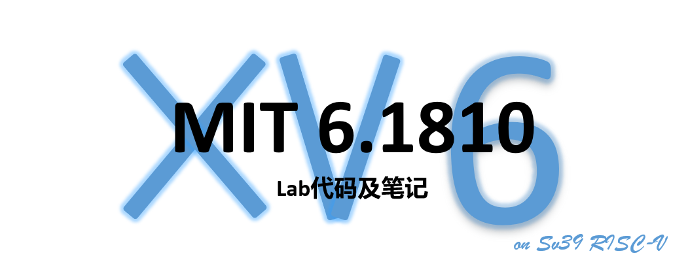

### 课程介绍

MIT6.1810 Operating System Engineering 是麻省理工学院计算机科学本科的中级课程，前身是 6.s081 和 6.828。6.828 于 2019 年更新为 6.S081，于 2022 年更新为 6.1810。课程基于 RISCV 架构以及类 unix 操作系统 xv6，介绍了操作系统最重要的几个基本概念，比如系统调用、页表、中断、多线程、网络、文件系统等等。课程以 10 个 lab 为主体，每个 lab 都有独立的分支，评测代码在本地。

### 相关资料

- 课程官网：https://pdos.csail.mit.edu/6.828/2022/index.html
- xv6 book：https://pdos.csail.mit.edu/6.828/2022/xv6/book-riscv-rev3.pdf
- 6.s081 课程 Lecture 翻译：https://github.com/huihongxiao/MIT6.S081

### Lab 文档

一共 10 个实验，针对于 OS 的不同概念，每个实验都有几个子实验，官方给子实验标注了难度，分为 easy、moderate、hard，但我建议不要去看难度标注，所做的工作都是线性的，慢慢都能做完。

- **Lab: Xv6 and Unix utilities**
  - **目标**：初步了解 xv6，实现一些简单的用户态命令和 utilities。
  - **文档**：[doc-lab1](doc/Lab1-Utilities/lab1.md)

- **Lab: system calls**
  - **目标**：实现一些简单的系统调用，借此熟悉 xv6 系统调用的工作流程。
  - **文档**：[doc-lab2](doc/Lab2-System_Calls/lab2.md)

- **Lab: page tables**
  - **目标**：探索 xv6 页表机制，熟悉如何使用页表。
  - **文档**：[doc-lab3](doc/Lab3-Page_Tables/lab3.md)

- **Lab: traps**
  - **目标**：探索 RSIC-V 汇编指令集，熟悉 xv6 的 trap 机制。
  - **文档**：[doc-lab4](doc/Lab4-Traps/lab4.md)

- **Lab: Copy-on-Write Fork for xv6**
  - **目标**：实现写时复制（cow），利用 page fault 进行触发。
  - **文档**：[doc-lab5](doc/Lab5-Copy_on_Write/lab5.md)
  
- **Lab: Multithreading**
  - **目标**：熟悉 xv6 的线程切换实现机制
  - **文档**：[doc-lab6](doc/Lab6-Multithreading/lab6.md)

- **Lab: network driver**
  - **目标**：使用网卡 E1000 完成 xv6 对链路帧的收发。
  - **文档**：[doc-lab7](doc/Lab7-Network_Driver/lab7.md)

