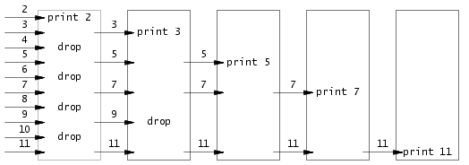

## Lab: Xv6 and Unix utilities

本 lab 为入门实验，旨在对 xv6 有个基础的了解，并学会如何编写用户态的 uitlities，难度较小，无需阅读 xv6 book。一共分为 6 个子 lab。

- **Boot xv6**：初始环境搭建，能够连接 qemu 并运行已经写好的命令行工具。
- **sleep**：实现用户命令 sleep，能够接受命令行输入，以秒为单位暂停。
- **pingpong**：基础的管道（pipe）实验，利用已有的 pipe 接口，实现父子进程之间的双向通信。
- **primes**：利用多线程和 pipe 实现 prime sieve 算法。
- **find**：实现用户命令 find，能够递归的去查找用户输入的文件名。
- **xargs**：实现用户命令 xargs，具体含义参考：[阮一峰：xargs讲解](https://www.ruanyifeng.com/blog/2019/08/xargs-tutorial.html)。

Boot 实验为环境搭建，网上资料很多，也没什么需要注意的点，文档就略过了。

### sleep (easy)

> Implement the UNIX program `sleep` for xv6; your `sleep` should pause for a user-specified number of ticks. A tick is a notion of time defined by the xv6 kernel, namely the time between two interrupts from the timer chip. Your solution should be in the file `user/sleep.c`.

在用户态实现一个 sleep，调用内核态的 sleep 去暂停进程。实际上，内核态的 sleep 已经实现了，因此本实验不需要额外写什么，其主要目的为让我们了解如何去编写一个用户态命令。

首先，不论什么用户态命令，都需要在 Makefile 中将其加入构建目录中。每一个目标都对应一个 .c 文件，该文件中实现了对应的用户命令。

``` makefile
UPROGS=\
	$U/_cat\
	$U/_echo\
	$U/_forktest\
	$U/_grep\
	....
	$U/_sleep\
```

所有的用户命令都在 `user/` 目录中实现，sleep 也不例外。在 user/ 下新建 sleep.c 文件，文件的代码框架参考其他用户命令文件，这里不赘述了。所有命令的第一件事都是接收参数，通过 argc、argv 获取命令行参数。sleep 的代码很简答，核心就两行：

``` c
int time = atoi(argv[1]);
sleep(time);
```

 ### pingpong (easy)

> Write a program that uses UNIX system calls to ''ping-pong'' a byte between two processes over a pair of pipes, one for each direction. The parent should send a byte to the child; the child should print "<pid>: received ping", where <pid> is its process ID, write the byte on the pipe to the parent, and exit; the parent should read the byte from the child, print "<pid>: received pong", and exit. Your solution should be in the file `user/pingpong.c`.

利用 pipe 实现父子进程的通信。pipe 的使用方法这里不再赘述，要注意的是，pipe 是单向管道，因此要建立两个 pipe 来实现双向通信。代码如下：

```c
int
main(int argc, char *argv[])
{
    if(argc != 1){
        printf("pingpong: need no parameter\n");
    }

    // 父->子: pipe1; 子->父: pipe2;
    int pipe1[2],pipe2[2];
    int stat1 = pipe(pipe1);
    int stat2 = pipe(pipe2);
    if(stat1 != 0 || stat2 != 0){
        printf("pipe() failed\n");
        exit(0);
    }
    
    int pid = fork();
    if(pid < 0){
        printf("fork() failed\n");
    }else if(pid == 0){
        // 子
        int pid_c = getpid();
        char buf[1024];
        read(pipe1[0],buf,sizeof(buf));
        if(buf[0] != 0){
            printf("%d: received ping\n",pid_c);
            write(pipe2[1],"b",1);
        }
    }else{
        // 父
        int pid_f = getpid();
        write(pipe1[1],"a",1);
        char buf[1024];
        read(pipe2[0],buf,sizeof(buf));
        if(buf[0] != 0){
            printf("%d: received pong\n",pid_f);
        }  
    }
    exit(0);
}
```

### primes (moderate)/(hard)

> Write a concurrent version of prime sieve using pipes. This idea is due to Doug McIlroy, inventor of Unix pipes. The picture halfway down [this page](http://swtch.com/~rsc/thread/) and the surrounding text explain how to do it. Your solution should be in the file `user/primes.c`.

刚看实验要求时可能一脸懵，反正我是懵了。实验目的是利用多线程筛选出素数，我们平时写的所有算法基本都是单线程的，而这里要实现一个多线程素数筛法，即 prime sieve 算法。算法介绍参考：[prime sieve](https://swtch.com/~rsc/thread/)。

用一张图概括算法，如下：



每一个方块为一个进程，该进程接受父进程传来的数列，首个元素为素数，然后筛掉首个元素的倍数，将余下的传给子进程，依次递归。实际上，这种算法并不能减少时间复杂度，虽然是多线程，但也是串行的，因此和单线程比没有时间优势。然而就是文档中说的，大部分时刻用多线程并不是为了效率，而是为了清晰。

> Concurrent programming in this style is interesting for reasons not of efficiency but of clarity

算法弄清了代码就很好实现了，如下：

```c
int main(int argc, char *argv[]){
    if(argc != 1){
        printf("primes: need no parameter\n");
    }

    int w_buf[34];
    int cnt = 0;
    for(int i=2;i<36;i++){
        w_buf[cnt] = i;
        cnt ++;
    }
    while(cnt != 0){
        int fd[2];
        pipe(fd);
        write(fd[1],w_buf,sizeof(w_buf));
        int pid = fork();
        if(pid == 0){
            int r_buf[34];
            read(fd[0],r_buf,sizeof(r_buf));

            // 记得关描述符
            close(fd[0]);
            close(fd[1]);

            int prime = r_buf[0];
            printf("prime %d\n",prime);
            cnt = 0;
            for(int i=1;i<34;i++){
                if(r_buf[i] == 0) break;
                if(r_buf[i] % prime != 0){
                    w_buf[cnt] = r_buf[i];
                    cnt ++;
                }
            }
            //printf("cnt = %d\n",cnt);
            for(int i=cnt;i<36;i++){
                w_buf[i] = 0;
            }
        } else {
            wait(NULL); // 父进程要等待子进程结束
            break;
        }

    }
    exit(0);
}
```

有两点需要重点注意。

- 父进程需要等待子进程结束在 exit。
- pipe 用完记得关！多线程通信实际通过的是文件，而 pipe 就是一个文件描述符。首先，文件名描述符用完就关是个必须养成的好习惯。其次，xv6 允许同时存在的文件描述符数量特别少。据测试只有十几个，不关 pipe 的话很快就会超限。

### find (moderate)

> Write a simple version of the UNIX find program: find all the files in a directory tree with a specific name. Your solution should be in the file `user/find.c`.

实现 find，递归查找文件。思路和 ls 一样，可以参考 `user/ls.c` 的递归遍历文件方式。

需要注意的是，如果接用了 ls 的 fmtname，那么文件名是要补全的。fmtname会把文件名用空格补全至 DIRSIZ（14），即将 "a.txt" 补全至 "a.txt         "。

当通过路径获取到文件描述符后，可通过 fstat 获取文件的状态 stat。该结构记录了文件类型、链接数、大小等信息，如下：

```c
struct stat {
  int dev;     // File system's disk device
  uint ino;    // Inode number
  short type;  // Type of file
  short nlink; // Number of links to file
  uint64 size; // Size of file in bytes
};
```

通过 st.type 来判断文件里类型，如果是 DEVICE 或是 FILE 则进行字符传比较，如果是 DIR 则进入递归就行，比较简单。

``` c
void find(char *path, char *target){
    // ...
    switch(st.type){
        case T_DEVICE:
        case T_FILE:
            // target补全至fmtname格式
            memset(target+strlen(target),' ', DIRSIZ-strlen(target));
            if(strcmp(fmtname(path), target) == 0){
                printf("%s\n",path);
            }
            break;

        case T_DIR:
            if(strlen(path) + 1 + DIRSIZ + 1 > sizeof(buf)){
                printf("find: path too long \n");
                break;
            }
            strcpy(buf, path);
            p = buf + strlen(buf);
            *p++ = '/';

            while(read(fd, &de, sizeof(de)) == sizeof(de)){

                if(de.inum == 0) continue;
                memmove(p,de.name,DIRSIZ);
                p[DIRSIZ] = 0;

                if(strcmp(de.name,".") != 0 && strcmp(de.name,"..") != 0){
                    //printf("file: %s\n", de.name);
                    //printf("buf: %s\n",buf);
                    find(buf, target);
                }
            }
            break;
    }

    // 一定要记住关fd
    // 经测试，xv6最多允许同时存在14个fd
    // 如果不关的话，资源会很快超限
    close(fd);
}
```

### xargs (moderate)

> Write a simple version of the UNIX xargs program: its arguments describe a command to run, it reads lines from the standard input, and it runs the command for each line, appending the line to the command's arguments. Your solution should be in the file `user/xargs.c`.

本实验需要实现 xargs，这个命令我从来都没用过，所以刚看的时候很懵，不知道 xargs 是干啥的。需要弄懂两个概念：1. `|` 是干什么的，2. `xargs` 是干什么的。一篇博客全部弄懂：[阮一峰：xargs讲解](https://www.ruanyifeng.com/blog/2019/08/xargs-tutorial.html)。

首先解释管道命令 `|`，用了这么久还没弄清楚概念。

``` shell
$ ls . | grep a.txt
```

管道命令的作用，是将左侧命令（`ls .`）的标准输出转换为标准输入，提供给右侧命令（`grep a.txt`）作为参数。因此我们常将 `|` 与`grep` 结合用来在第一条命令的结果中进行查找。

然后解释 `xargs`，其作用就是将标准输入转为命令行参数。

```shell
$ echo "one two three" | xargs mkdir
```

上述命令实际等同于 mkdir one two three，会生成 3 个目录。

了解作用后开始写代码，实现 xargs 主要分为 4 步：

1. 读取 xargs 后的显式命令以及参数；
2. 读取 | 产生的标准输入；
3. 将 2 读取到的字符传以空格为分隔转换为多个参数；
4. 将 1 和 2 结果拼接起来通过 exec 执行。

将一行字符串拆解为多个参数可以封装为一个独立的函数：

```c
void fmt_params(char* line, char** params, int* cnt){
    char cur_param[MAX_PARAM_LEN];
    int cur_param_len = 0;
    for(int i=0; i<strlen(line); i++){

        if((line[i] == ' ' || line[i] == '\n')&& cur_param_len!=0){
            //printf("%s\n",cur_param);
            params[*cnt] = malloc(MAX_PARAM_LEN);
            memmove(params[*cnt],cur_param,cur_param_len);
            params[*cnt][cur_param_len] = 0;
            cur_param_len = 0;
            (*cnt) ++;
        } 
        else {
            cur_param[cur_param_len] = line[i];
            cur_param_len ++;
        }
    }

}
```

main 分别实现 1、2、4 三步即可，代码如下：

```c
int main(int argc, char *argv[]){
    // 读取 xargs 后的命令以及参数
    if(argc == 1) exit(0);
    char* params[MAX_PARAMS_CNT];  // 参数
    int cnt = 0;
    for(int i=1; i<argc; i++){
        params[i-1] = argv[i];
        cnt ++;
    }
    //printf("params[0]:%s\n",params[0]);

    // 读取 | 产生的标准输入
    char r_buf[MAX_STDIN_LEN];
    while(read(STDIN_FILENO,r_buf,MAX_STDIN_LEN) > 0){  // 逐行读取
        if(fork()==0){
            // 子
            fmt_params(r_buf,params,&cnt);
            // 注意，exec第二个参数的第一个元素指向cmd可执行文件，而不是指命令参数
            // 类似于argv
            exec(params[0],params);
        }else{
            // 父
            wait(0);
        }
    }
    exit(0);
}
```

至此，lab1 的必做部分就完成了，难度较低，即使是标了 hard 的 primes，在了解算法之后也是很简单。

### 问题与注意点

完成 `primes` 时 pipe 资源超限。

- 实际上是文件描述符（fd）超过限制，xv6 系统允许同时存在的 fd 数量很少，据测试只有十几个，因此如果不及时关闭 pipe_fd 的话，就会超限。
- 解决办法：pipe_fd 用完立刻 close 掉，养成随手释放资源的好习惯。

完成 `find` 时 fd 资源超限。

- 原因同上，每次递归完要及时释放 fd，否则很快就超限了。

`xargs` 不知道啥意思，`|` 用了这么久也还不清楚。

- 一篇博客弄明白：[阮一峰：xargs](https://www.ruanyifeng.com/blog/2019/08/xargs-tutorial.html) 。

